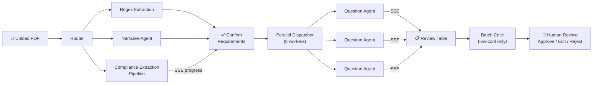
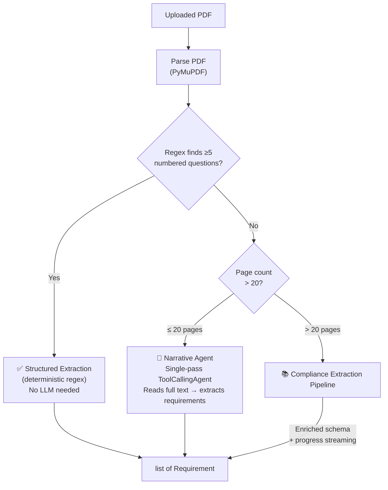
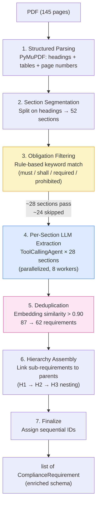
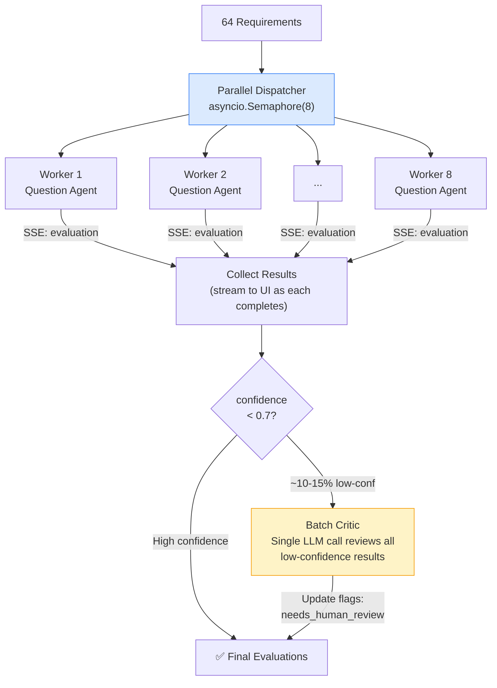
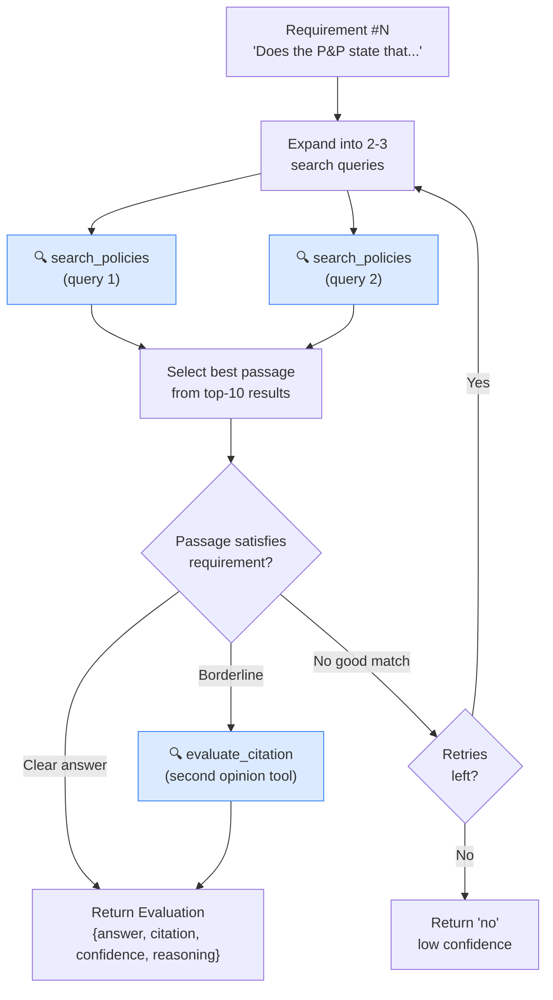
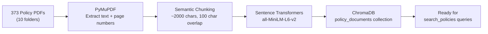

# Readily — Agentic Compliance Review

Automates healthcare P&P policy audits against regulatory checklists. AI agents review each compliance question against 373+ policy PDFs using RAG, then stream results to a React UI for human approval.

## Agentic Workflows

### End-to-End Pipeline



### 1. Requirement Extraction Router

Three-way routing based on document type and length. Runs once per uploaded PDF.



### 2. Compliance Extraction Agent (Long Documents)

For long regulatory PDFs (e.g. 145-page DHCS policy guides). Segments the document, filters for obligation language, extracts per-section in parallel, then deduplicates and assembles a hierarchy.



### 3. Parallel Dispatcher + Batch Critic

Fans out N requirements to concurrent workers, streams results via SSE, then runs a reflection pass on low-confidence results.



### 3.1 Question Agent (RAG per Requirement)

One self-contained `ToolCallingAgent` is created per compliance requirement. Each parallel worker instantiates its own agent with no shared state.



### 5. Ingestion Pipeline (One-Time Setup)

Parses 373 policy PDFs, chunks them, generates embeddings, and stores in ChromaDB.



## Prerequisites

- Python 3.11+
- Node.js 18+
- A [Gemini API key](https://aistudio.google.com/apikey)

## Setup

### 1. Clone and enter the project

```sh
git clone <repo-url> && cd readily
```

### 2. Backend

Create a virtual environment and install dependencies:

```sh
python3 -m venv .venv
source .venv/bin/activate
pip install -r backend/requirements.txt
```

### 3. Frontend

```sh
cd frontend
npm install
cd ..
```

### 4. Environment variables

Create a `.env` file in the project root (or export directly):

```sh
export GEMINI_API_KEY="your-gemini-api-key"
```

Optional overrides (defaults shown):

```sh
export LLM_MODEL_ID="gemini-2.5-pro"
export MAX_CONCURRENT_WORKERS=8
export CONFIDENCE_THRESHOLD=0.7
```

Alternatively:

```sh
cp .env.sample .env
```

### 5. Policy data

Place the policy PDFs under `data/Public Policies/` with the expected folder structure:

```
data/Public Policies/
├── AA/   (19 PDFs)
├── CMC/  (4 PDFs)
├── DD/   (11 PDFs)
├── EE/   (12 PDFs)
├── FF/   (24 PDFs)
├── GA/   (5 PDFs)
├── GG/   (144 PDFs)
├── HH/   (47 PDFs)
├── MA/   (69 PDFs)
└── PA/   (38 PDFs)
```

## Running

### Step 1: Ingest policy PDFs into ChromaDB (one-time)

```sh
python -m backend.ingestion.ingest
```

This parses all PDFs, chunks them, generates embeddings, and stores them in `chroma_db/`. Takes ~5–10 minutes for the full corpus.

### Step 2: Start the backend

```sh
uvicorn backend.main:app --reload --port 8000
```

The API will be available at `http://localhost:8000`. Key endpoints:

| Method | Endpoint | Description |
|--------|----------|-------------|
| POST | `/upload` | Upload a review form PDF |
| GET | `/upload/{id}/extraction-stream` | SSE progress for long doc extraction |
| POST | `/review/{id}/start` | Start parallel review |
| GET | `/review/{id}/stream` | SSE stream of evaluation results |
| GET | `/review/{id}/results` | All evaluations |
| PATCH | `/review/{id}/results/{n}` | Edit one evaluation |
| POST | `/review/{id}/bulk-approve` | Bulk approve |
| GET | `/review/{id}/export` | Export CSV |

### Step 3: Start the frontend

```sh
cd frontend
npm run dev
```

Opens at `http://localhost:5173`. Upload a review form PDF (e.g. `data/Example Input Doc - Easy.pdf`) to start.

## Testing

```sh
# Backend tests
pytest backend/tests/

# Frontend typecheck
cd frontend && npm run typecheck
```

## Project Structure

```
readily/
├── backend/
│   ├── agents/
│   │   ├── dispatcher.py            # Parallel fan-out (asyncio semaphore)
│   │   ├── question_agent.py        # Per-question ToolCallingAgent
│   │   ├── critic.py                # Batch reflection on low-confidence results
│   │   ├── extractor.py             # Requirement extraction (3-way routing)
│   │   └── compliance_extractor.py  # Long-doc extraction pipeline
│   ├── tools/
│   │   ├── pdf_parser.py            # PyMuPDF text extraction
│   │   ├── review_form_parser.py    # Structured form regex parser
│   │   ├── policy_search.py         # ChromaDB vector search
│   │   ├── narrative_extractor.py   # Single-pass LLM extraction
│   │   └── document_segmenter.py    # Section segmentation for long docs
│   ├── ingestion/
│   │   ├── ingest.py                # Bulk PDF → ChromaDB pipeline
│   │   └── chunker.py               # Semantic-aware text chunking
│   ├── models/
│   │   └── schemas.py               # Pydantic models (shared contracts)
│   ├── config.py
│   └── requirements.txt
├── frontend/
│   └── src/
│       ├── api/client.ts
│       ├── components/              # UploadForm, ReviewTable, EvidenceCard, etc.
│       ├── hooks/                   # useReview (SSE), useExtractionProgress
│       └── types.ts
├── data/                            # Policy PDFs + example input docs
├── docs/                            # Design documents (00–08)
└── README.md
```

## Tech Stack

- **Backend**: Python, FastAPI, smolagents (`OpenAIModel` + `ToolCallingAgent`), ChromaDB, PyMuPDF, sentence-transformers
- **Frontend**: React 18, TypeScript, Vite, TailwindCSS
- **LLM**: Gemini 2.5 Pro via Gemini's OpenAI-compatible endpoint
- **Vector Store**: ChromaDB (local persistence, zero-config)

## Design Docs

Detailed component designs are in `docs/`:

- [00 — Architecture Overview](docs/00-architecture.md)
- [01 — Data Models](docs/01-data-models.md)
- [02 — Ingestion Pipeline](docs/02-ingestion-pipeline.md)
- [03 — Requirement Extraction](docs/03-requirement-extraction.md)
- [04 — Question Agent + RAG](docs/04-question-agent.md)
- [05 — Parallel Dispatcher + Critic](docs/05-parallel-dispatcher.md)
- [06 — API Server](docs/06-api-server.md)
- [07 — React Frontend](docs/07-react-frontend.md)
- [08 — Compliance Extraction Agent](docs/08-compliance-extraction-agent.md)
